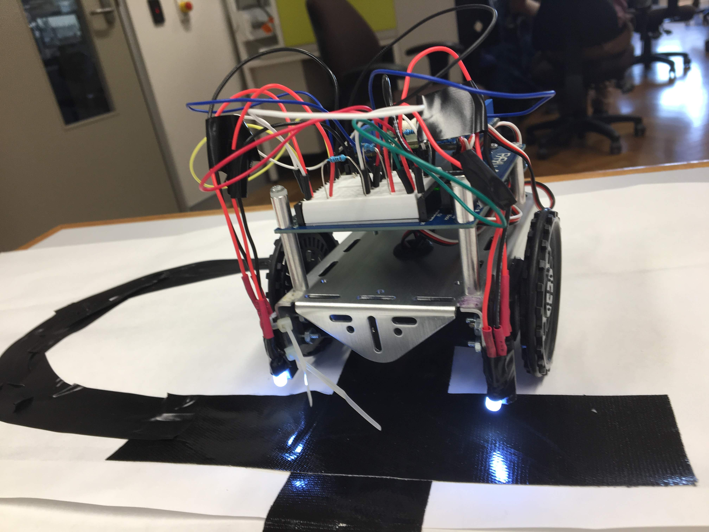
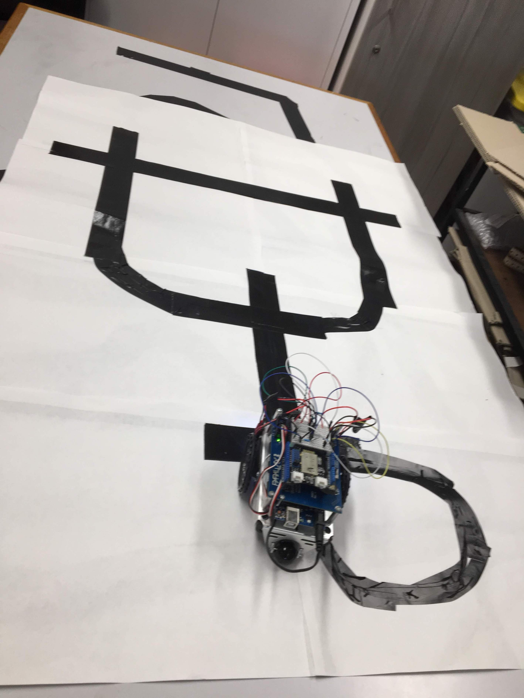

# Self-driving bluetooth enabled Arduino Robot

## Watch the video: https://drive.google.com/open?id=1lNT7PY4f7IOL4SH8x4v3kzOeeo285yah

## What:

This is a prototype of a restaurant food-delivering waiter. It is a robot, initially stationed in the kitchen, that responds to bluetooth signals and drives out, following the black tape as its path. It is able to decide, through hardcoded instructions, whether to turn left, right or go forward at each intersections. The image below shows the track.

In our test environment, we had 2 separate tables (see image above, though not in image, the table A is on the left top intersection and table B is on the right top intersection), each holding 2 buttons: one that could hail the robot to go to the table to take orders and another to send the robot back to the kitchen. The interesting part of this project was figuring out how to deal with intersections along the black tape as well as cleverly using photoresistors and LEDs to detect the black line. 

Programming Language used: Arduino programming language

## Why:

This was our final group project for an electrical subject called Introduction to computer systems (ELEC1601). 

## Where:
Made in a electrical engineering laboratoy at the University Of Sydney.

## When:

Spent a total of 18 hours to finish this project.

Note: This project ended up in the Hall of Fame for best projects of 2019.
